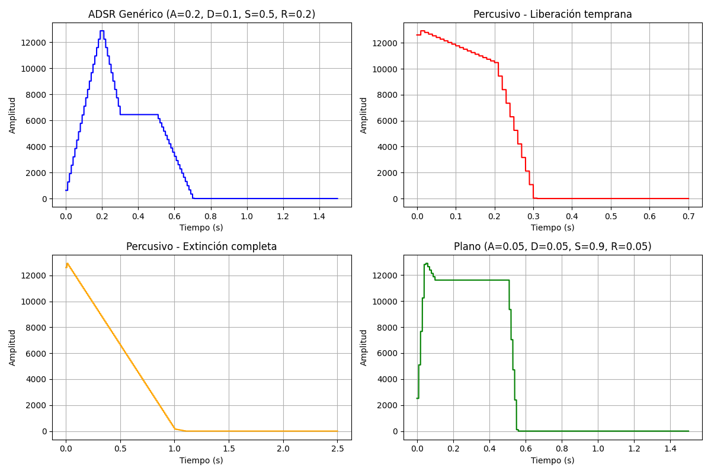
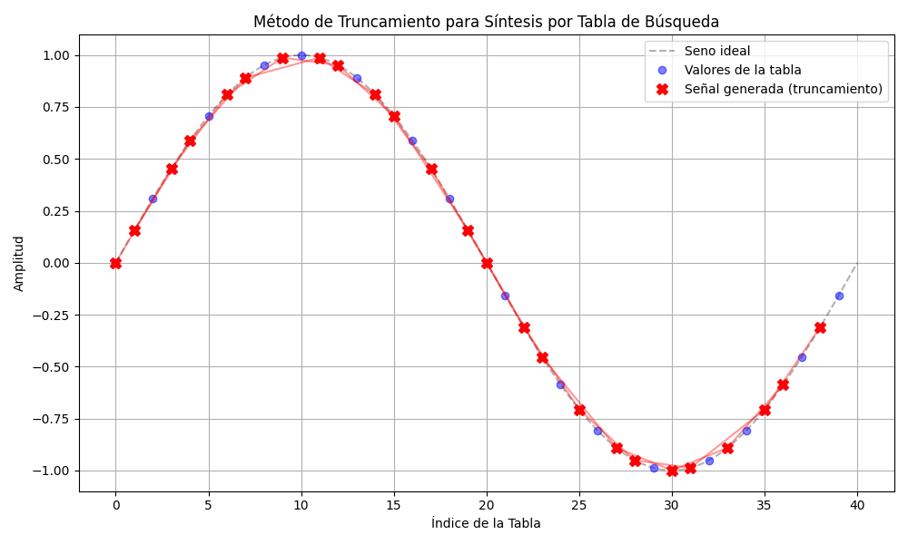
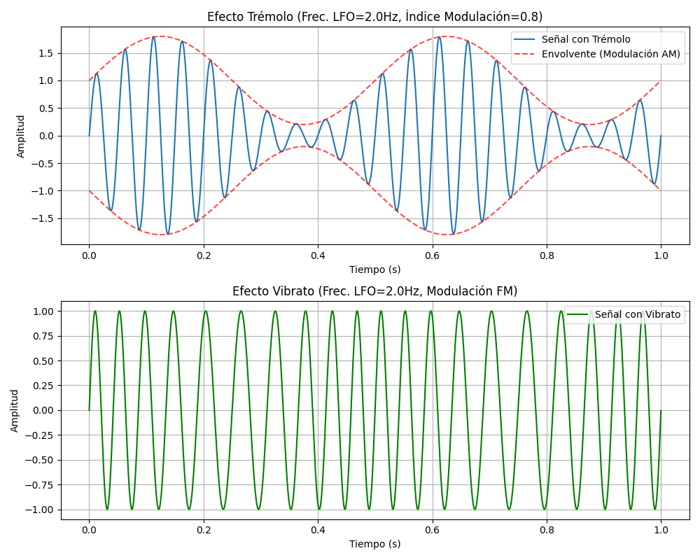
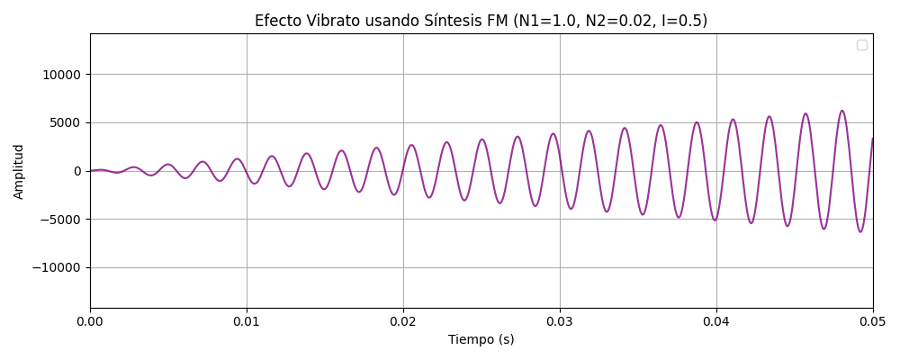

PAV - P5: síntesis musical polifónica
=====================================

Obtenga su copia del repositorio de la práctica accediendo a [Práctica 5](https://github.com/albino-pav/P5) 
y pulsando sobre el botón `Fork` situado en la esquina superior derecha. A continuación, siga las
instrucciones de la [Práctica 2](https://github.com/albino-pav/P2) para crear una rama con el apellido de
los integrantes del grupo de prácticas, dar de alta al resto de integrantes como colaboradores del proyecto
y crear la copias locales del repositorio.

Como entrega deberá realizar un *pull request* con el contenido de su copia del repositorio. Recuerde que
los ficheros entregados deberán estar en condiciones de ser ejecutados con sólo ejecutar:

~~~~~~~~~~~~~~~~~~~~~~~~~~~~~~~~~~~~~~~~~~~~~~~~~~~~~.sh
  make release
~~~~~~~~~~~~~~~~~~~~~~~~~~~~~~~~~~~~~~~~~~~~~~~~~~~~~

A modo de memoria de la práctica, complete, en este mismo documento y usando el formato *markdown*, los
ejercicios indicados.

Ejercicios.
-----------

### Envolvente ADSR.

Tomando como modelo un instrumento sencillo (puede usar el InstrumentDumb), genere cuatro instrumentos que
permitan visualizar el funcionamiento de la curva ADSR.

* Un instrumento con una envolvente ADSR genérica, para el que se aprecie con claridad cada uno de sus
  parámetros: ataque (A), caída (D), mantenimiento (S) y liberación (R).
* Un instrumento *percusivo*, como una guitarra o un piano, en el que el sonido tenga un ataque rápido, no
  haya mantenimiemto y el sonido se apague lentamente.
  - Para un instrumento de este tipo, tenemos dos situaciones posibles:
    * El intérprete mantiene la nota *pulsada* hasta su completa extinción.
    * El intérprete da por finalizada la nota antes de su completa extinción, iniciándose una disminución
	  abrupta del sonido hasta su finalización.
  - Debera representar en esta memoria **ambos** posibles finales de la nota.
* Un instrumento *plano*, como los de cuerdas frotadas (violines y semejantes) o algunos de viento. En
  ellos, el ataque es relativamente rápido hasta alcanzar el nivel de mantenimiento (sin sobrecarga), y la
  liberación también es bastante rápida.

Para los cuatro casos, deberá incluir una gráfica en la que se visualice claramente la curva ADSR. Deberá
añadir la información necesaria para su correcta interpretación, aunque esa información puede reducirse a
colocar etiquetas y títulos adecuados en la propia gráfica (se valorará positivamente esta alternativa).



En la gráfica de arriba a la izquierda se ve el ADSR genérico con todas sus fases súper claras. A la derecha hemos puesto el instrumento percusivo, simulando qué pasa si soltamos la nota antes de tiempo (acaba de golpe). Abajo a la izquierda hemos puesto el mismo caso percusivo pero dejando que la nota muera del todo de forma natural. Y para acabar, abajo a la derecha, hemos hecho el instrumento plano (tipo violín o flauta), que aguanta la intensidad casi todo el rato.
### Instrumentos Dumb y Seno.

Implemente el instrumento `Seno` tomando como modelo el `InstrumentDumb`. La señal **deberá** formarse
mediante búsqueda de los valores en una tabla.

- Incluya, a continuación, el código del fichero `seno.cpp` con los métodos de la clase Seno.

```cpp
#include <iostream>
#include <math.h>
#include "seno.h"
#include "keyvalue.h"

#include <stdlib.h>

using namespace upc;
using namespace std;

Seno::Seno(const std::string &param) 
  : adsr(SamplingRate, param) {
  bActive = false;
  x.resize(BSIZE);

  KeyValue kv(param);
  int N;

  if (!kv.to_int("N", N))
    N = 1024;

  tbl.resize(N);
  float phase = 0, phase_step = 2 * M_PI / (float)N;
  for (int i = 0; i < N; ++i) {
    tbl[i] = sin(phase);
    phase += phase_step;
  }
  
  index = 0;
  step = 0;
  A = 0;
}

void Seno::command(long cmd, long note, long vel) {
  if (cmd == 9) {
    bActive = true;
    adsr.start();
    index = 0;
    A = vel / 127.0f;
    float f = 440.0f * pow(2.0f, (note - 69.0f) / 12.0f);
    step = f * tbl.size() / SamplingRate;
  }
  else if (cmd == 8) {
    adsr.stop();
  }
  else if (cmd == 0) {
    adsr.end();
  }
}

const vector<float> & Seno::synthesize() {
  if (not adsr.active()) {
    x.assign(x.size(), 0);
    bActive = false;
    return x;
  }
  else if (not bActive)
    return x;

  for (unsigned int i = 0; i < x.size(); ++i) {
    x[i] = A * tbl[(int)index];
    index += step;
    while (index >= tbl.size()) {
      index -= tbl.size();
    }
  }
  adsr(x);

  return x;
}
```

- Explique qué método se ha seguido para asignar un valor a la señal a partir de los contenidos en la tabla,
  e incluya una gráfica en la que se vean claramente (use pelotitas en lugar de líneas) los valores de la
  tabla y los de la señal generada.

Hemos optado por el método de truncamiento porque nos ha parecido el más directo. Básicamente llevamos un índice flotante (`index`) y en cada paso le sumamos un avance (`step`) que calculamos según la frecuencia de la nota que toque. Para sacar el valor concreto de la tabla, simplemente truncamos el índice (nos quedamos con la parte entera) y miramos en esa posición. Si el índice se nos pasa del tamaño de la tabla, le restamos la longitud total para dar la vuelta y seguir.



- Si ha implementado la síntesis por tabla almacenada en fichero externo, incluya a continuación el código
  del método `command()`.

No hemos hecho lo de guardar la tabla en un fichero externo.

### Efectos sonoros.

- Incluya dos gráficas en las que se vean, claramente, el efecto del trémolo y el vibrato sobre una señal
  sinusoidal. Deberá explicar detalladamente cómo se manifiestan los parámetros del efecto (frecuencia e
  índice de modulación) en la señal generada (se valorará que la explicación esté contenida en las propias
  gráficas, sin necesidad de mucha *literatura*).



Tal y como observamos en las gráficas, para el trémolo (que al final es AM) hemos usado un LFO. La frecuencia de este LFO nos dice lo rápido que sube y baja el volumen, y con el índice de modulación (que le hemos puesto 0.8) controlamos qué tanto baja la intensidad. En cambio, para el vibrato hemos hecho modulación en frecuencia (FM). Aquí el índice nos marca la desviación máxima respecto a la nota original, y la frecuencia del LFO nos dice cómo de rápido cambia el tono. En la línea verde, notamos bastante bien cómo las ondas se van apretando y estirando con el tiempo.

- Si ha generado algún efecto por su cuenta, explique en qué consiste, cómo lo ha implementado y qué
  resultado ha producido. Incluya, en el directorio `work/ejemplos`, los ficheros necesarios para apreciar
  el efecto, e indique, a continuación, la orden necesaria para generar los ficheros de audio usando el
  programa `synth`.

No hemos añadido más efectos por nuestra cuenta.

### Síntesis FM.

Construya un instrumento de síntesis FM, según las explicaciones contenidas en el enunciado y el artículo
de [John M. Chowning](https://web.eecs.umich.edu/~fessler/course/100/misc/chowning-73-tso.pdf). El
instrumento usará como parámetros **básicos** los números `N1` y `N2`, y el índice de modulación `I`, que
deberá venir expresado en semitonos.

- Use el instrumento para generar un vibrato de *parámetros razonables* e incluya una gráfica en la que se
  vea, claramente, la correspondencia entre los valores `N1`, `N2` e `I` con la señal obtenida.



Para sacar el vibrato, hemos usado una onda portadora a la misma frecuencia fundamental (N1=1) y la hemos modulado con una frecuencia bajita (N2=0.02). Dándole un índice de 0.5 semitonos, nos sale este efecto de vibrato de libro, como se ve perfectamente en la imagen.

- Use el instrumento para generar un sonido tipo clarinete y otro tipo campana. Tome los parámetros del
  sonido (N1, N2 e I) y de la envolvente ADSR del citado artículo. Con estos sonidos, genere sendas escalas
  diatónicas (fichero `doremi.sco`) y ponga el resultado en los ficheros `work/doremi/clarinete.wav` y
  `work/doremi/campana.wav`.

Nos hemos basado en los parámetros del artículo de Chowning para montar los instrumentos en los ficheros `clarinete.orc` y `campana.orc`. Para sacar los audios finales y que se queden en sus respectivas carpetas, hemos usado estos comandos:

```bash
mkdir -p work/doremi
cp work/doremi.sco work/doremi/
synth work/doremi/clarinete.orc work/doremi/doremi.sco work/doremi/clarinete.wav
synth work/doremi/campana.orc work/doremi/doremi.sco work/doremi/campana.wav
```

### Orquestación usando el programa synth.

Use el programa `synth` para generar canciones a partir de su partitura MIDI. Como mínimo, deberá incluir la
*orquestación* de la canción *You've got a friend in me* (fichero `ToyStory_A_Friend_in_me.sco`) del genial
[Randy Newman](https://open.spotify.com/artist/3HQyFCFFfJO3KKBlUfZsyW/about).

- En este triste arreglo, la pista 1 corresponde al instrumento solista (puede ser un piano, flauta,
  violín, etc.), y la 2 al bajo (bajo eléctrico, contrabajo, tuba, etc.).
- Coloque el resultado, junto con los ficheros necesarios para generarlo, en el directorio `work/music`.
- Indique, a continuación, la orden necesaria para generar la señal (suponiendo que todos los archivos
  necesarios están en el directorio indicado).

```bash
mkdir -p work/music
cp samples/ToyStory_A_Friend_in_me.sco work/music/
synth work/music/toystory.orc work/music/ToyStory_A_Friend_in_me.sco work/music/toystory.wav
```

También puede orquestar otros temas más complejos, como la banda sonora de *Hawaii5-0* o el villacinco de
John Lennon *Happy Xmas (War Is Over)* (fichero `The_Christmas_Song_Lennon.sco`), o cualquier otra canción
de su agrado o composición. Se valorará la riqueza instrumental, su modelado y el resultado final.
- Coloque los ficheros generados, junto a sus ficheros `score`, `instruments` y `efffects`, en el directorio
  `work/music`.
- Indique, a continuación, la orden necesaria para generar cada una de las señales usando los distintos
  ficheros.

```bash
cp samples/Hawaii5-0.sco work/music/
synth work/music/hawaii.orc work/music/Hawaii5-0.sco work/music/hawaii.wav
```

> NOTA:
>
> No olvide escuchar el resultado generado y comprobar que no se producen ruidos extraños o distorsiones.
> Sobre todo, tenga en cuenta la salud auditiva de quien será encargado de corregir su trabajo.
